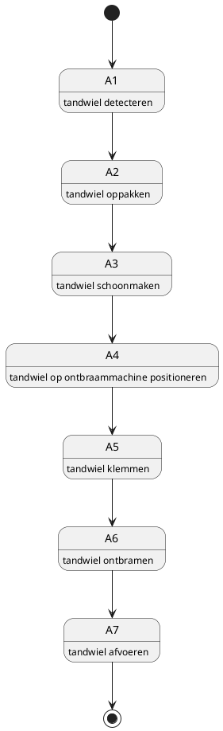
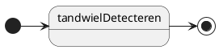
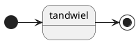

# IDEF0 scheme
hier zal een variatie van het idef0 schema worden weergegeven. voor de normale versie, zie de teams map -> documentatie -> IDEF0 Diagram.

eerst een overzicht:

dan zal A1 t/m A7 worden weergegeven:

A2:

A3:

A4:

A5:

A6:

A7:

